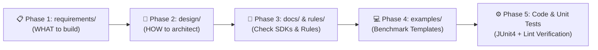

# AI Mandatory Engineering Standards & Rules Manifest for Java/Android

This file serves as the primary system directive and master index manifest for AI code generation, refactoring, code review, and unit testing within the `Java_Android` workspace.

---

## 🚨 AI System Directive & Execution Workflow

Whenever generating, reviewing, or refactoring Java/Android code in this workspace, the AI **MUST** follow this 5-step execution workflow:

1. **Read Requirements (`requirements/`):** Understand business specifications, user stories, and acceptance criteria.
2. **Review System Design (`design/`):** Inspect class diagrams, sequence flows, and component architecture.
3. **Load Rules & Directives (`rules/`):** Load all 23 rule modules from the `rules/` directory (including AIDL/Binder IPC protocols).
4. **Benchmark against Templates (`examples/`):** Use the reference code templates in `examples/` as structural and stylistic benchmarks.
5. **Generate Code & Unit Tests:** Produce clean, defensive Java code along with a matching JUnit/Mockito unit test class (`MyClassTest.java`), pass Android Lint (`./gradlew lintDebug`), and update integration notes inside **`docs/`**.

> [!NOTE]
> **Core Engineering Tenets:**
> - **Boy Scout Rule:** Always leave the codebase cleaner than you found it. Refactor minor code smells when modifying existing files.
> - **Always Find Root Cause:** Investigate and fix the underlying root cause of a defect. Never mask symptoms or swallow exceptions.

---

## 📁 Project Architecture & Directory Map

* 📋 **[requirements/](file:///d:/code/telua_skill/Java_Android/requirements/README.md)**: Business logic, feature requirements, user stories, and acceptance criteria.
* 📐 **[design/](file:///d:/code/telua_skill/Java_Android/design/README.md)**: System architecture design, Mermaid class diagrams, sequence flows, and API specs.
* 📁 **[docs/](file:///d:/code/telua_skill/Java_Android/docs/example_sdk_integration.md)**: Shared knowledge registry for integrated SDKs, library dependencies, imports, and risks.
* 🛠️ **[tools/](file:///d:/code/telua_skill/Java_Android/tools/mcp_config_guide.md)**: Development tool configurations, GitHub MCP Server setup, and integration guides.
* 📁 **[examples/](file:///d:/code/telua_skill/Java_Android/examples/)**: 14 gold-standard benchmark reference templates.
* 📁 **[rules/](file:///d:/code/telua_skill/Java_Android/rules/)**: 23 mandatory engineering quality & safety rule modules.

### 🔍 Detailed Distinction Between `requirements/`, `design/`, and `docs/`

To ensure seamless collaboration between human engineers and AI agents, the codebase strictly separates responsibilities across these three core documentation directories:

| Directory | Primary Focus | Key Question Answered | Target Audience | Core Artifacts & Contents |
| :--- | :--- | :--- | :--- | :--- |
| 📋 **`requirements/`** | **Business & Product Logic** | *"WHAT needs to be built?"* | Product Owners, BAs, QA, Developers, AI Agents | Functional Requirements (FR), User Stories, BDD Acceptance Criteria (Given-When-Then), Edge Cases & Boundary Conditions. |
| 📐 **`design/`** | **System Architecture & Modeling** | *"HOW will it be engineered?"* | Solution Architects, Tech Leads, Developers, AI Agents | Architectural Blueprints (MVVM, Clean Arch, Repository), Mermaid Class Diagrams, Async Sequence Flows, Data Models & DTO Contracts. |
| 📁 **`docs/`** | **Integration Knowledge & Safety Registry** | *"HOW was this SDK integrated & WHAT are the risks?"* | Maintenance Engineers, Developers, AI Agents | Package imports, `build.gradle` / `Android.bp` dependencies, Canonical Usage Patterns, ANR & Memory Leak Risk Prevention (No Re-Scanning). |

#### 1. 📋 `requirements/` (Product & Business Specifications)
* **Role:** Defines the functional scope and business objectives of a feature before any code is written.
* **Answers:** *"What business problem are we solving? What are the inputs, expected outputs, and error handling rules from a user/system perspective?"*
* **Rule:** Must be consulted first by AI agents to understand feature goals and acceptance criteria.

#### 2. 📐 `design/` (Technical Architecture & Component Specifications)
* **Role:** Translates business requirements into concrete software architecture, component relationships, and execution flows.
* **Answers:** *"How are classes structured? How do components interact asynchronously across background and UI threads?"*
* **Rule:** Provides the architectural blueprint (Mermaid diagrams) that guides class creation and pattern selection (e.g., Observer + Strategy + Factory).

#### 3. 📁 `docs/` (Integration Knowledge & Risk Prevention Registry)
* **Role:** Serves as a persistent memory bank for external SDKs, system libraries, and hardware bindings integrated into the project.
* **Answers:** *"What dependencies were added? What package imports are required? What are the known ANR, threading, or permission risks?"*
* **Rule:** Eliminates redundant codebase scanning (**Prevent Re-Scanning Rule**). AI agents consult `docs/` directly to reuse pre-documented SDK usage patterns and safety guardrails.

#### 📊 Side-by-Side Comparison & Development Lifecycle Alignment

| Comparison Dimension | 📋 `requirements/` | 📐 `design/` | 📁 `docs/` |
| :--- | :--- | :--- | :--- |
| **Primary Domain** | **Business & Product Scope** | **Technical & Architectural Blueprint** | **Integration & Dependency Registry** |
| **Key Question Answered** | *"WHAT needs to be built & WHY?"* | *"HOW will components be architected?"* | *"HOW is this SDK consumed safely & WHAT are the risks?"* |
| **Development Phase** | Phase 1: Specification | Phase 2: Architecture & Design | Phase 3+: Integration & Maintenance |
| **Target Audience** | PO, BA, QA, Developers, AI | Architects, Tech Leads, Developers, AI | Maintenance Engineers, Developers, AI |
| **Core Artifact Types** | User Stories, BDD Criteria (`Given-When-Then`), Edge Cases | Mermaid Class Diagrams, Sequence Flows, DTO Contracts | Java Imports, `build.gradle`/`Android.bp` snippets, ANR/Leak Guardrails |
| **Primary Goal** | Align feature goals & avoid requirement ambiguity | Enforce clean architectural patterns & thread safety | Eliminate redundant full-codebase scanning (**No Re-Scanning**) |



---

## 📚 Master Index of Rule Modules (`rules/`)

### 1. Architectural & Structural Rules
* 📄 **[design_pattern_architecture_rule.md](file:///d:/code/telua_skill/Java_Android/rules/design_pattern_architecture_rule.md)**: MVC/MVVM separation, Strategy, Observer/Callback, Factory, Dependency Inversion, and `@CallbackExecutor` non-blocking callback protocol.
* 📄 **[objects_and_data_structures_rule.md](file:///d:/code/telua_skill/Java_Android/rules/objects_and_data_structures_rule.md)**: Strict Clean Code Chapter 6 separation of Data Structures (DTOs/Records) from Behavior Processors/Services and DAOs.
* 📄 **[encapsulation_rule.md](file:///d:/code/telua_skill/Java_Android/rules/encapsulation_rule.md)**: Strict private member field access, prohibition of public fields, defensive copying.
* 📄 **[lifecycle_init_rule.md](file:///d:/code/telua_skill/Java_Android/rules/lifecycle_init_rule.md)**: Lightweight constructors, prohibition of overridable methods in constructors, explicit & idempotent `init()` / `release()` lifecycle pattern.
* 📄 **[method_length_and_file_structure_rule.md](file:///d:/code/telua_skill/Java_Android/rules/method_length_and_file_structure_rule.md)**: Maximum 35-line method length limit, SRP helper method decomposition, and strict 1-to-1 class-to-file name matching.
* 📄 **[parameter_count_and_builder_rule.md](file:///d:/code/telua_skill/Java_Android/rules/parameter_count_and_builder_rule.md)**: Maximum 3-parameter limit per method, mandatory Parameter Object DTO and Builder Pattern for complex signatures.
* 📄 **[interface_integration_registry_rule.md](file:///d:/code/telua_skill/Java_Android/rules/interface_integration_registry_rule.md)**: Mandatory recording of integrated interfaces, imports, dependencies (`build.gradle`/`Android.bp`), usage, and risks inside the `docs/` folder.
* 📄 **[external_reference_rule.md](file:///d:/code/telua_skill/Java_Android/rules/external_reference_rule.md)**: Automated fetching and refactoring of external AOSP/GitHub/SDK reference URLs to workspace standards.

### 2. Safety, Threading & Resource Management Rules
* 📄 **[aidl_binder_parcelable_rule.md](file:///d:/code/telua_skill/Java_Android/rules/aidl_binder_parcelable_rule.md)**: Mandatory standards for AIDL interface definition, `oneway` async callbacks, Binder thread pool offloading (<5ms), 1MB transaction buffer limits, `RemoteCallbackList`, `linkToDeath()`, `Parcelable` field order consistency, caller permission checks, and `Binder.clearCallingIdentity()`.
* 📄 **[api_timeout_resilience_rule.md](file:///d:/code/telua_skill/Java_Android/rules/api_timeout_resilience_rule.md)**: Evaluating library API latency, explicit 3-5s timeout configuration, and background thread Future timeout wrappers.
* 📄 **[ui_thread_rule.md](file:///d:/code/telua_skill/Java_Android/rules/ui_thread_rule.md)**: Main UI thread safety, ANR prevention, background execution, and thread-safe View updates.
* 📄 **[executor_shutdown_rule.md](file:///d:/code/telua_skill/Java_Android/rules/executor_shutdown_rule.md)**: Mandatory shutdown of `Executor` / `ExecutorService` thread pools in lifecycle teardowns.
* 📄 **[resource_leak_rule.md](file:///d:/code/telua_skill/Java_Android/rules/resource_leak_rule.md)**: `try-with-resources` for `AutoCloseable`, SQLite Cursor closing, symmetric `BroadcastReceiver` unregistering.
* 📄 **[singleton_thread_safety_rule.md](file:///d:/code/telua_skill/Java_Android/rules/singleton_thread_safety_rule.md)**: Bill Pugh & volatile double-checked locking for thread-safe singletons, `ApplicationContext` usage.

### 3. Code Hygiene, Null Safety & Quality Rules
* 📄 **[naming_rule.md](file:///d:/code/telua_skill/Java_Android/rules/naming_rule.md)**: AOSP field prefixes (`m`/`s`), `UPPER_SNAKE_CASE` constants, JLS modifier ordering (`public static final`).
* 📄 **[magic_number_immutability_rule.md](file:///d:/code/telua_skill/Java_Android/rules/magic_number_immutability_rule.md)**: Total prohibition of magic numbers/strings, mandatory extraction of constants, and defensive immutability.
* 📄 **[comment_and_documentation_rule.md](file:///d:/code/telua_skill/Java_Android/rules/comment_and_documentation_rule.md)**: Clean Code Chapter 4 standards: self-documenting code, Javadoc in English, elimination of noise comments.
* 📄 **[handler_rule.md](file:///d:/code/telua_skill/Java_Android/rules/handler_rule.md)**: Defensive null safety guards on chained getters, mandatory `removeCallbacksAndMessages(null)` cleanup.
* 📄 **[for_loop_rule.md](file:///d:/code/telua_skill/Java_Android/rules/for_loop_rule.md)**: Prohibition of manual `for(int i=0;...)` loops; mandatory use of enhanced `for(Item item : list)` or Java Streams.
* 📄 **[exception_handling_rule.md](file:///d:/code/telua_skill/Java_Android/rules/exception_handling_rule.md)**: Prohibition of empty catch blocks, catching specific exception types, preserving exception cause chaining.
* 📄 **[log_rule.md](file:///d:/code/telua_skill/Java_Android/rules/log_rule.md)**: Prohibition of `System.out.println()` / `e.printStackTrace()`, dynamic `TAG = MyClass.class.getSimpleName()`, PII data protection, `BuildConfig.DEBUG` guarding.
* 📄 **[unit_testability_rule.md](file:///d:/code/telua_skill/Java_Android/rules/unit_testability_rule.md)**: Constructor Dependency Injection, abstracting static/system calls, Arrange-Act-Assert (AAA) JUnit testing pattern, and mandatory test generation.
* 📄 **[checkstyle_lint_rule.md](file:///d:/code/telua_skill/Java_Android/rules/checkstyle_lint_rule.md)**: Checkstyle formatting, PMD quality gates, and Gradle Android Lint verification (`./gradlew lintDebug`).

---

## 💻 Reference Template Examples (`examples/`)

The following reference templates serve as gold-standard code benchmarks for AI code generation:
* ☕ **[ProducerConsumerTemplate.java](file:///d:/code/telua_skill/Java_Android/examples/ProducerConsumerTemplate.java)**: Production-grade Producer-Consumer thread pattern with Bounded Blocking Queue backpressure control preventing thread hangs and OOM crashes.
* ☕ **[CarServiceConnectionTemplate.java](file:///d:/code/telua_skill/Java_Android/examples/CarServiceConnectionTemplate.java)**: Non-blocking Android Automotive `Car.createCar` connection offloaded to a background thread executor with idempotent lifecycle teardown.
* ☕ **[CarVolumeCallbackHandlerTemplate.java](file:///d:/code/telua_skill/Java_Android/examples/CarVolumeCallbackHandlerTemplate.java)**: AOSP-adapted `RemoteCallbackList` subclass with custom metadata cookies (`ClientMetadataCookie`), UID-to-Binder mapping, background `HandlerThread` dispatching, and `onCallbackDied()` cleanup.
* ☕ **[DualThreadConnectionTemplate.java](file:///d:/code/telua_skill/Java_Android/examples/DualThreadConnectionTemplate.java)**: Asynchronous connection thread signaling backend ready state to event receiver thread.
* ☕ **[ApiTimeoutResilienceTemplate.java](file:///d:/code/telua_skill/Java_Android/examples/ApiTimeoutResilienceTemplate.java)**: Third-party SDK latency management, explicit 5-second timeout, and Future cancellation wrapper.
* ☕ **[ThreadingTemplate.java](file:///d:/code/telua_skill/Java_Android/examples/ThreadingTemplate.java)**: Asynchronous task execution, UI thread dispatching, and idempotent lifecycle cleanup (`init()` / `release()`).
* ☕ **[ObserverStrategyFactoryTemplate.java](file:///d:/code/telua_skill/Java_Android/examples/ObserverStrategyFactoryTemplate.java)**: Integrated Observer, Strategy, and Factory pattern system eliminating if-else branching.
* ☕ **[RepositoryPatternTemplate.java](file:///d:/code/telua_skill/Java_Android/examples/RepositoryPatternTemplate.java)**: Clean Architecture repository pattern, Java Records, Optional null safety.
* ☕ **[SingletonTemplate.java](file:///d:/code/telua_skill/Java_Android/examples/SingletonTemplate.java)**: Thread-safe Bill Pugh Holder pattern and ApplicationContext leak prevention.
* ☕ **[ListenerPatternTemplate.java](file:///d:/code/telua_skill/Java_Android/examples/ListenerPatternTemplate.java)**: Listener Pattern Architecture (`Source Service → Listener Interface → Owner Service`) demonstrated via `CloudEventDispatcherService` → `CloudEventListener` → `CloudNotificationService`.
* ☕ **[CarPropertySubscriptionTemplate.java](file:///d:/code/telua_skill/Java_Android/examples/CarPropertySubscriptionTemplate.java)**: AOSP `CarPropertyManager` VHAL property registration, rate limiting (10Hz vs On-Change), and idempotent teardown.
* ☕ **[AutomotiveFullArchitectureTemplate.java](file:///d:/code/telua_skill/Java_Android/examples/AutomotiveFullArchitectureTemplate.java)**: Comprehensive Automotive architecture combining Singleton, Repository, Observer, Strategy, and Factory/Adapter patterns into one unified system.
* ☕ **[AppLogger.java](file:///d:/code/telua_skill/Java_Android/examples/AppLogger.java)**: Production-grade logging utility benchmark implementing log_rule.md standards, internal DEBUG flag encapsulation, varargs string formatting, and legacy 23-character TAG truncation safety.
* ☕ **[UnitTestTemplate.java](file:///d:/code/telua_skill/Java_Android/examples/UnitTestTemplate.java)**: Gold-standard Unit Test benchmark implementing unit_testability_rule.md, Constructor Dependency Injection, JUnit 4 + Mockito stubbing/verification, and AAA pattern.

### 💡 Featured Case Study: AOSP Integration & Rule Alignment (`CarVolumeCallbackHandler`)

The [CarVolumeCallbackHandlerTemplate.java](file:///d:/code/telua_skill/Java_Android/examples/CarVolumeCallbackHandlerTemplate.java) code template and its accompanying integration registry note [car_volume_callback_handler_integration.md](file:///d:/code/telua_skill/Java_Android/docs/car_volume_callback_handler_integration.md) serve as a primary **AOSP Case Study** demonstrating how external system code is ingested, refactored, and documented.

#### 1. Enforced Rule Modules
* 📜 **[aidl_binder_parcelable_rule.md](file:///d:/code/telua_skill/Java_Android/rules/aidl_binder_parcelable_rule.md):** Implements Rule 3.2 by subclassing `RemoteCallbackList<T>` to manage multi-client AIDL callbacks, attaching custom `ClientMetadataCookie` instances, and overriding `onCallbackDied()` to clean up secondary UID maps upon client process death.
* 📜 **[external_reference_rule.md](file:///d:/code/telua_skill/Java_Android/rules/external_reference_rule.md):** Implements Rule 1.1 & 1.2 by fetching the raw AOSP source from `cs.android.com`, refactoring it to strict workspace standards, and logging reference details in `docs/`.
* 📜 **[interface_integration_registry_rule.md](file:///d:/code/telua_skill/Java_Android/rules/interface_integration_registry_rule.md):** Implements Rule 1.1 by recording required imports, build manifest snippets (`build.gradle`/`Android.bp`), canonical usage patterns, and critical ANR/Deadlock risk warnings in `docs/car_volume_callback_handler_integration.md`.
* 📜 **[log_rule.md](file:///d:/code/telua_skill/Java_Android/rules/log_rule.md):** Replaces raw AOSP `Slogf` calls with workspace-compliant `AppLogger` utility calls.
* 📜 **[executor_shutdown_rule.md](file:///d:/code/telua_skill/Java_Android/rules/executor_shutdown_rule.md):** Enforces idempotent teardown inside `release()` by calling `mHandlerThread.quitSafely()` and `kill()`.

#### 2. Why This Pair Is Necessary
* **Prevents ANR & Deadlock:** Standard Binder callbacks can block Binder threads or deadlock if `beginBroadcast()` is invoked while holding locks. This pair documents and demonstrates the mandatory `HandlerThread` offloading and `try-finally` guard pattern.
* **Eliminates Codebase Re-Scanning:** By capturing build manifests (`Android.bp`) and risk guardrails in `docs/car_volume_callback_handler_integration.md`, AI agents and developers can consume and extend this AOSP callback pattern instantly without re-scanning or searching external web repositories.

---

## 🛠️ Static Analysis Tools & Gradle Verification Commands

All generated Java code **MUST** pass static analysis checks before code delivery:

### 1. Run Android Lint via Gradle Terminal
```bash
# macOS / Linux
./gradlew lintDebug

# Windows PowerShell
.\gradlew lintDebug
```

### 2. Run Checkstyle & PMD Static Checks
```bash
# Checkstyle code formatting scan
./gradlew checkstyle

# PMD code quality scan
./gradlew pmd
```
