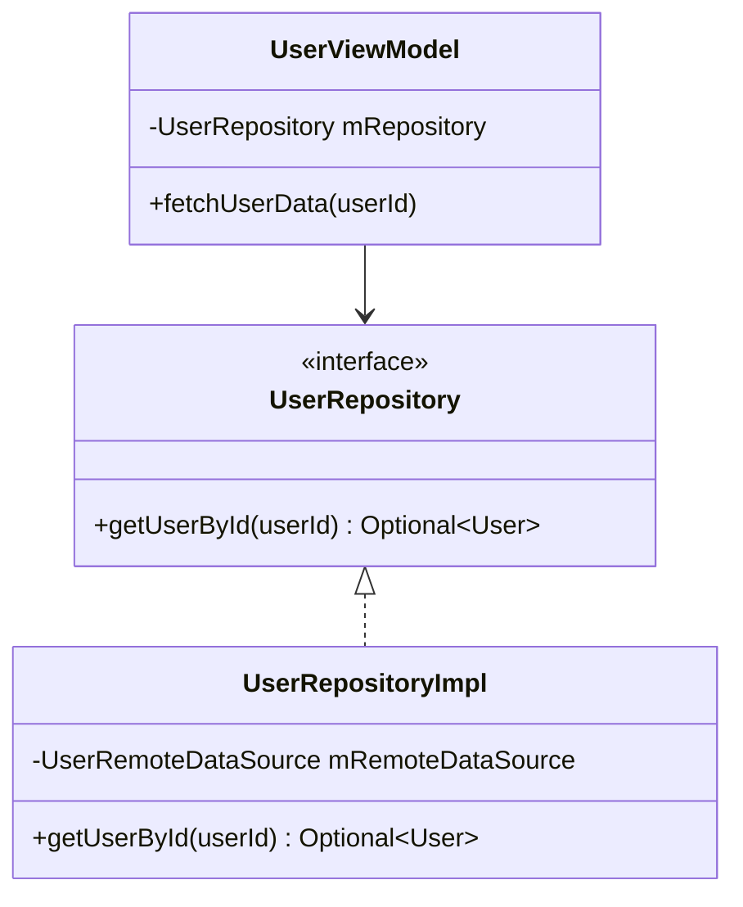
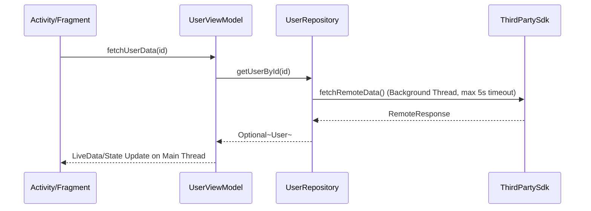

# Architectural Design & System Modeling Guide (`design/`)

This directory contains system design documents, architectural blueprints, Mermaid class diagrams, sequence flows, and API specs for `Java_Android` features.

---

## 📐 Standard System Design Template (`design/<feature_name>_design.md`)

Whenever designing a new feature or refactoring architecture, create a markdown file inside `design/` using the following standard template:

```markdown
# System Architecture Design: [Feature Name]

## 1. High-Level Architectural Overview
Explanation of the design pattern used (e.g., Clean Architecture, MVVM, Repository Pattern, Strategy + Observer).

## 2. Component Class Diagram (Mermaid)


## 3. Asynchronous Sequence Flow (Mermaid)


## 4. Data Models & API Contracts
Define immutable data holders (Java Records), DTOs, and interface method contracts.
```
