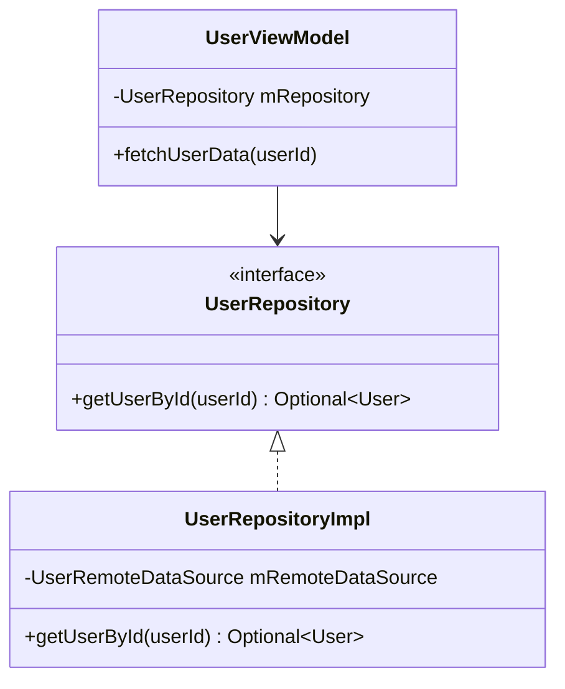
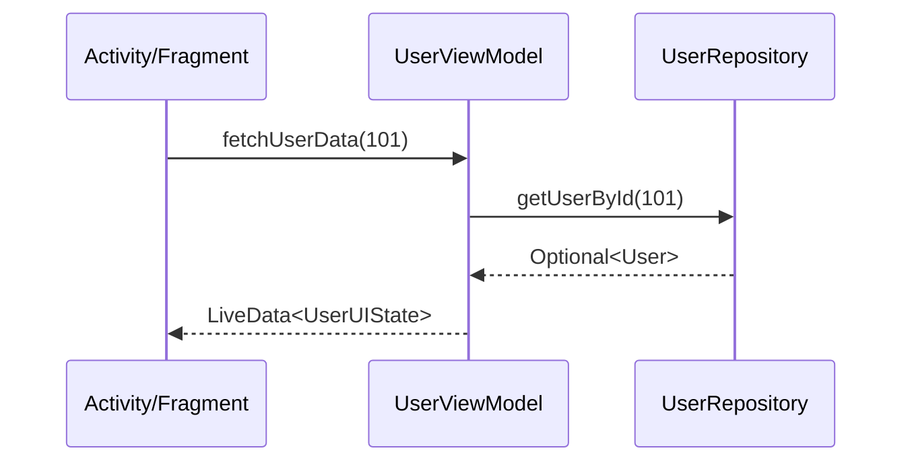

<!--
  Copyright (C) 2026 letrthong@gmail.com
  Created & Maintained by: letrthong@gmail.com
  Generated & Refactored by: Gemini 3.6 Pro (Google DeepMind)
  Licensed under the Apache License, Version 2.0
-->

# System Architecture Design: [Feature Name]

## 1. High-Level Architectural Overview
Explanation of the design pattern used (e.g., Clean Architecture, MVVM, Repository Pattern, Strategy + Observer).

## 2. Component Class Diagram (Mermaid)

## 3. Asynchronous Sequence Flow (Mermaid)

## 4. API Contract & Component Interfaces
Defensive method signatures, parameter limits ($\le 3$), return types (`Optional<T>`, `LiveData<T>`), and Exception propagation strategy.

## 5. Threading & Resilience Strategy
Background thread execution details, ANR prevention guards, timeout boundaries (3-5s), and resource cleanup lifecycle.
