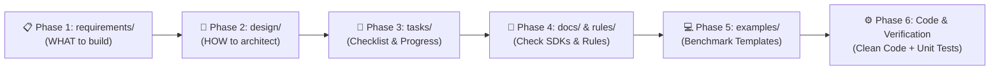

<!--
  Copyright (C) 2026 letrthong@gmail.com
  Created & Maintained by: letrthong@gmail.com
  Generated & Refactored by: Gemini 3.6 Pro (Google DeepMind)
  Licensed under the Apache License, Version 2.0 (http://www.apache.org/licenses/LICENSE-2.0)
-->

# Spec-Driven Development & Design-First Architecture Rules (spec_driven_development_rule.md)

This document defines the mandatory **Spec-Driven Development (SDD)** protocol for the `Java_Android` repository. It enforces a strict "Design & Requirements First" methodology across human developers and AI coding agents.

---

## 1. Core Principles

### Rule 1.1: The Golden Rule — "No Spec, No Design $\rightarrow$ No Code"
* **Strict Prohibition of Ad-Hoc Coding:** Writing, refactoring, or generating production Java classes without prior documented specifications in `requirements/` and an approved architectural design in `design/` is **STRICTLY PROHIBITED**.
* **Zero Hallucinated Architecture:** AI coding agents must never guess business rules, invent informal API endpoints, or improvise concurrency patterns on the fly. All implementation logic must derive directly from an approved design document.

### Rule 1.2: The 6-Phase Engineering Lifecycle
Every feature, service, or architectural change must progress through 6 distinct phases in sequential order:

1. **Phase 1: Requirements Specification (`requirements/`):**
   * Articulate user stories, functional requirements (FR), non-functional requirements (NFR), and edge cases.
   * Provide Behavior-Driven Development (BDD) acceptance criteria in `Given-When-Then` format.
2. **Phase 2: Architectural Design & Blueprint (`design/`):**
   * Structure component classes using Clean Architecture and Gang-of-Four design patterns (Strategy, Observer, Factory).
   * Provide visual Mermaid diagrams: Class structure, asynchronous sequence flows, and threading models.
   * Formulate immutable DTO contracts (Java Records) separating data from behavior.
3. **Phase 3: Task Breakdown & Checklist (`tasks/`):**
   * Register the feature into [tasks/CHECKLIST.md](file:///d:/code/telua_skill/Java_Android/tasks/CHECKLIST.md).
   * Create a dedicated task card (`tasks/TASK_XX_*.md`) with granular, trackable checkbox items (`[x]` / `[ ]`).
4. **Phase 4: Dependency & Safety Pre-Check (`docs/` & `rules/`):**
   * Consult `docs/` to reuse existing SDK bindings and avoid redundant codebase rescanning (**Prevent Re-Scanning Rule**).
   * Review all relevant safety rules (e.g. `thread_safety_concurrency_rule.md`, `ui_thread_rule.md`, `api_timeout_resilience_rule.md`).
5. **Phase 5: Implementation (`examples/` & Production Code):**
   * Locate the closest gold-standard benchmark in `examples/` as the structural template.
   * Generate production classes strictly adhering to the approved design blueprint.
6. **Phase 6: Automated Verification & Sign-Off:**
   * Write JUnit 4 test suites using the Arrange-Act-Assert (AAA) pattern.
   * Execute `./gradlew testDebugUnitTest` and `./gradlew lintDebug`.
   * Check off completed subtasks in `tasks/` and obtain developer sign-off.

### Rule 1.3: Human-AI Collaboration Protocol & Architectural Sign-Off
* **Role of the AI Coding Agent:**
  * AI acts as the architectural researcher and drafting assistant: generating detailed requirements, proposing alternative architectural solutions, creating Mermaid diagrams, and writing benchmark implementations.
  * AI must pause and present architectural trade-offs to the human developer before writing extensive code.
* **Role of the Human Developer / Tech Lead:**
  * The human developer reviews the requirements and design specifications, evaluates the proposed trade-offs, and provides explicit architectural sign-off.
  * The developer selects the preferred pattern (e.g., choosing *Pull-based Provider Indirection* vs. *Push-based Multi-Subscriber*).

---

## 2. Directory Responsibilities & Boundary Matrix

| Directory | Primary Responsibility | Question Answered | Deliverables |
| :--- | :--- | :--- | :--- |
| 📋 **`requirements/`** | Business logic & scope | *"WHAT needs to be built & WHY?"* | User Stories, BDD Given-When-Then criteria, Edge Cases |
| 📐 **`design/`** | System architecture & modeling | *"HOW will it be engineered?"* | Mermaid diagrams, Sequence flows, DTO Records, Interfaces |
| 📌 **`tasks/`** | Execution tracking & progress | *"WHERE are we & WHAT'S next?"* | Master `CHECKLIST.md`, step-by-step task cards (`TASK_XX_*.md`) |
| 📁 **`docs/`** | Integration knowledge & safety | *"HOW is this SDK used safely?"* | Dependencies, imports, ANR/leak prevention guardrails |
| 📁 **`rules/`** | Engineering standards & guardrails | *"WHAT rules MUST NOT be violated?"* | 26 mandatory quality, threading, and Clean Code standards |
| 💻 **`examples/`** | Production-ready reference code | *"WHAT does the gold standard look like?"* | 19 benchmark templates illustrating correct patterns |

---

## 3. Mandatory Gatekeeping Checklist (Before Writing Any Code)

Before creating or editing any `.java` production source file, the engineer or AI agent **MUST** verify all 5 gates:

* [ ] **Gate 1 (Requirements Gate):** Is there a corresponding file in `requirements/` defining the user story and BDD acceptance criteria?
* [ ] **Gate 2 (Design Gate):** Is there a corresponding architectural spec in `design/` with Mermaid class/sequence diagrams and defined interfaces?
* [ ] **Gate 3 (Task Tracking Gate):** Is the task registered in [tasks/CHECKLIST.md](file:///d:/code/telua_skill/Java_Android/tasks/CHECKLIST.md) and tracked via a `tasks/TASK_XX_*.md` checklist?
* [ ] **Gate 4 (Docs & Rules Gate):** Have all external SDK dependencies and threading risks been cross-referenced with `docs/` and `rules/`?
* [ ] **Gate 5 (Human Sign-Off Gate):** Has the developer explicitly approved the proposed architectural design?

---

## 4. Anti-Patterns & Code Smells

### ❌ Anti-Pattern 1: "Vibe Coding" / Ad-Hoc Implementation
* **Violation:** Jumping directly into writing Java classes, services, or singletons without any documentation in `requirements/` or `design/`.
* **Consequence:** High risk of hallucinated business logic, tight coupling, thread safety hazards, and painful rewrites during code review.
* **Correction:** Stop immediately. Draft `requirements/` and `design/` first, get approval, then code.

### ❌ Anti-Pattern 2: Disconnected Documentation (Zombie Specs)
* **Violation:** Writing a requirement or design doc once, but changing the Java implementation completely during coding without updating the design artifact.
* **Consequence:** Documentation drift; future developers and AI agents are misled by outdated architectural specs.
* **Correction:** Treat `design/` and `requirements/` as living contracts. If implementation details shift, update the design document first.

### ❌ Anti-Pattern 3: Untracked Code Changes
* **Violation:** Implementing features across multiple sessions without updating [tasks/CHECKLIST.md](file:///d:/code/telua_skill/Java_Android/tasks/CHECKLIST.md).
* **Consequence:** Team members and AI agents lose visibility into feature completion status, duplicate work, or leave critical subtasks incomplete.
* **Correction:** Tick checkbox subtasks in `tasks/TASK_XX_*.md` after every completed commit or verification run.
