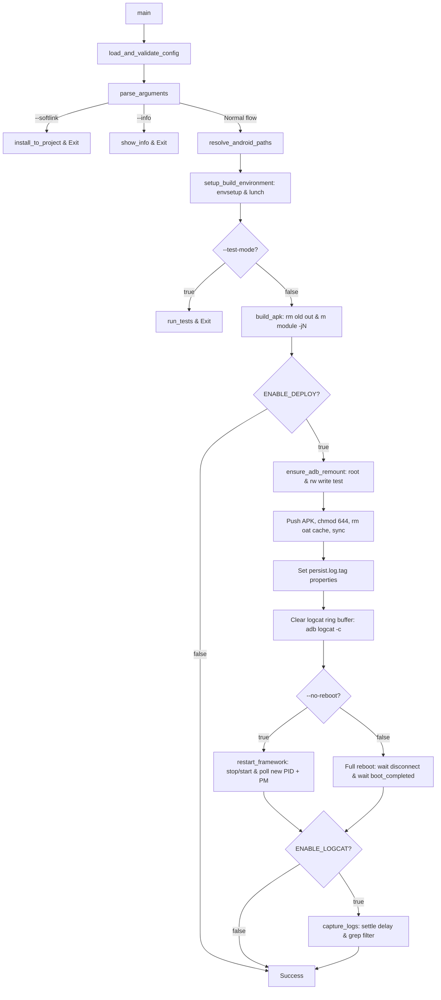

# build_apk.sh — AOSP System APK Build & Deployment Toolkit

An automated developer workflow script for building and deploying privileged system applications (`priv-app`) in **AOSP / Android Automotive** environments (Qualcomm QSSI architecture):

**lunch → build module → root & remount → push APK → reboot / fast restart → capture logcat**

| File | Purpose |
|---|---|
| `build_apk.sh` | Core execution script (orchestration logic) |
| `apk.config` | Project configuration (profile selection, lunch targets, deploy flags, debug tags) |

---

## 1. Prerequisites

> [!IMPORTANT]
> **Linux Only:** AOSP compilation tools (`build/envsetup.sh`, `lunch`, Soong, Ninja, and `m`) are strictly designed for Linux environments (e.g., Ubuntu LTS). This script cannot run directly on Windows Command Prompt or PowerShell. If editing on Windows, ensure files maintain Linux (LF) line endings before pushing to your Linux build host.

- **Linux build host** with an initialized AOSP source tree adhering to `.../android/qssi/` (must contain `build/envsetup.sh`).
- **ADB** (`platform-tools`) installed and accessible in `$PATH`.
- **Target Device** running a **`userdebug`** or **`eng`** build image. Production `user` builds strictly disallow `adb root` and `adb remount` (script will safely abort).
- Exactly **one** ADB device/DUT connected.
- Execute permissions and Linux (LF) line endings:
  ```bash
  chmod +x build_apk.sh
  dos2unix build_apk.sh apk.config   # required if files were transferred from Windows
  ```

---

## 2. Quick Start (Single Workspace)

Place `build_apk.sh` and `apk.config` anywhere inside the `android/` directory tree of your AOSP repo, then:

```bash
# 1. Select ACTIVE_PROJECT and set your lunch target
nano apk.config

# 2. Inspect target, module paths, and connected device info
./build_apk.sh --info

# 3. Build module, push to system partition, and reboot
./build_apk.sh
```

> **AOSP Discovery:** The script resolves the AOSP root by walking upwards from its directory until it finds an ancestor directory named `android`, setting `ANDROID_TOP=<...>/android/qssi`.

---

## 3. Multi-Workspace Architecture (`--softlink`)

Maintain **a single golden copy of `build_apk.sh`** shared across multiple independent AOSP checkouts, release branches, or workspaces. Each workspace maintains its own standalone `apk.config`.

```
~/code/telua_skill/.../build/           ← Master Repository (edit logic here)
├── build_apk.sh
└── apk.config                          ← Configuration Template

~/ws_main/android/qssi/tools/
├── build_apk.sh  -> (symlink to master build_apk.sh)
├── apk.config        (ACTIVE_PROJECT="oem_service", target A)
├── OemService.apk    (Build output artifact copied here)
└── deployment_log.txt

~/ws_release/android/qssi/tools/
├── build_apk.sh  -> (symlink to master build_apk.sh)
├── apk.config        (ACTIVE_PROJECT="car_audio", target B)
└── ...
```

### Installing to a Workspace

Run `--softlink <path>` from the master script:

```bash
# Target directory must exist and reside inside the target 'android/' tree
mkdir -p ~/ws_main/android/qssi/tools
./build_apk.sh --softlink ~/ws_main/android/qssi/tools

mkdir -p ~/ws_release/android/qssi/tools
./build_apk.sh --softlink ~/ws_release/android/qssi/tools
```

`--softlink <path>` automatically performs:
1. Creates `<path>/build_apk.sh` as a **symbolic link** pointing to the canonical master script.
2. **Copies** `apk.config` adjacent to the calling script into `<path>/apk.config`.
3. Safely **overwrites** existing links and files if present.

### Working Inside Each Workspace

```bash
cd ~/ws_main/android/qssi/tools
nano apk.config          # configure ACTIVE_PROJECT="oem_service", target A
./build_apk.sh --info
./build_apk.sh

cd ~/ws_release/android/qssi/tools
nano apk.config          # configure ACTIVE_PROJECT="car_audio", target B
./build_apk.sh
```

### Why This Architecture Works
- **Centralized Logic Updates:** Fixes and enhancements made to master `build_apk.sh` propagate instantly to every linked workspace without manual syncing.
- **Isolated Per-Project Configs:** Each workspace independently manages its `ACTIVE_PROJECT`, lunch target, CPU threads, and debug tags.
- **Context-Aware Path Resolution:** The script detects the `android/` root relative to the **location of the symlink**, not the master script. Executing the link in `ws_main` builds `ws_main`.
- **Isolated Artifacts:** Generated APKs and `deployment_log.txt` are created locally inside the workspace tools directory.

### Important Caveats
- Re-running `--softlink` against an existing directory will **overwrite `apk.config`** in that directory. Back up any customized config beforehand.
- New variables added to the master `apk.config` will not automatically backport to existing copies. The script relies on defaults (`${VAR:-...}`), but manual addition is needed to customize new flags.
- Symlinks placed outside an `android/` directory tree will trigger a warning and will fail to resolve `ANDROID_TOP`.
- Do not run deployments concurrently from two workspaces targeting the same physical device.

---

## 4. Command Line Options

| Option | Description |
|---|---|
| *(none)* | Full cycle: Build + Deploy (if `ENABLE_DEPLOY="true"`) + Full Device Reboot |
| `--info` | Displays project info, lunch target, paths, and ADB device state, then exits |
| `--start-deploy true\|false` | Overrides `ENABLE_DEPLOY` defined in `apk.config` |
| `--no-reboot` | Fast runtime restart (`stop && start`, ~10–15s) instead of full device reboot |
| `--softlink <path>` | Creates symlink to `build_apk.sh` and copies `apk.config` to `<path>` |
| `--test-mode true\|false` | Runs unit test suite instead of compiling the APK |
| `-h`, `--help` | Displays help message and exits |

#### Usage Examples:
```bash
./build_apk.sh --start-deploy false   # Compile APK only, do not push to device
./build_apk.sh --no-reboot            # Fast deploy after editing Java source files
./build_apk.sh --test-mode true       # Execute project test runner
```

> **When to avoid `--no-reboot`:** Perform a full device reboot if you modified `AndroidManifest.xml` (permissions, exported components, new services), SELinux `.te` policies, or added a brand new system app.

---

## 5. Configuration Reference (`apk.config`)

### 5.1 Project Profiles (`ACTIVE_PROJECT`)

```bash
ACTIVE_PROJECT="oem_service"   # "oem_service" | "car_audio" | "vehicle_service"
```

Each profile case defines the module parameters:

| Variable | Description |
|---|---|
| `MODULE_NAME` | AOSP compilation module identifier passed to `m <MODULE_NAME>`. Corresponds to `name:` in `Android.bp` or `LOCAL_PACKAGE_NAME` in `Android.mk`. If omitted, defaults to `${APK_FILE_NAME%.apk}` |
| `SOURCE_CODE_RELATIVE_PATH` | Path to module source directory relative to `ANDROID_TOP` (see details below) |
| `APK_OUTPUT_RELATIVE_PATH` | Target output directory relative to `ANDROID_TOP` (**cleaned before each build**) |
| `APK_FILE_NAME` | Expected output binary filename (e.g., `OemService.apk`) |
| `APK_DEPLOY_PATH` | Destination system directory on target device (e.g., `/system/priv-app/OemService`) |
| `DEFAULT_LOGCAT_FILTER` | Default regex filter for logcat capture |
| `DEFAULT_DEBUG_LOG_TAGS` | Default log tags to enable at `DEBUG` level for this service |

#### 💡 Source Code Directory Note (`SOURCE_CODE_RELATIVE_PATH`):
The directory specified by `SOURCE_CODE_RELATIVE_PATH` must contain the build and manifest definition files:
* **`Android.bp` (Soong build system):**
  Defines the module via `android_app { name: "OemService", srcs: [...], privileged: true }`. The `name` attribute is your `MODULE_NAME`.
* **`Android.mk` (GNU Make system):**
  Defines `LOCAL_PACKAGE_NAME := OemService` or `LOCAL_MODULE := OemService`.
* **`AndroidManifest.xml`:**
  Defines package name, shared user IDs (`android:sharedUserId="android.uid.system"`), system permissions, and services. Changes here require a full device reboot.

*To add a new service profile:* Copy an existing `"..." ) ... ;;` case block, update the paths, and set `ACTIVE_PROJECT` to your new profile name.

---

### 5.2 Build Environment

| Variable | Description |
|---|---|
| `CONFIG_TARGET_PRODUCT` | Target product for `lunch` (e.g., `abc_xyz_in`) |
| `CONFIG_TARGET_BUILD_VARIANT` | Target build variant (`userdebug` or `eng`) |
| `BUILD_JOBS` | Parallel compilation threads (`-j`). Leave empty `""` to auto-detect via `nproc` (fallback: 8) |

> **Active Shell Optimization:** If the current terminal session already has an active AOSP environment (`TARGET_PRODUCT` and `TARGET_BUILD_VARIANT` are set), the script **skips `envsetup.sh` and `lunch`** to save execution time.

---

### 5.3 Device Deployment & Diagnostics

| Variable | Default | Description |
|---|---|---|
| `ENABLE_DEPLOY` | `"true"` | Enables or disables pushing APK to connected device |
| `ENABLE_DEBUG_LOG` | `"true"` | Automatically sets debug log properties on the device |
| `DEBUG_LOG_LEVEL` | `"DEBUG"` | Target logging level (`DEBUG` or `VERBOSE`) |
| `DEBUG_LOG_TAGS` | profile default | Space-separated log tags (e.g., `"CarAudioService CarZones"`) |
| `ENABLE_LOGCAT` | `"false"` | Captures post-deployment logcat to file |
| `LOGCAT_FILTER` | profile default | Regex filter for `adb logcat -d \| grep -E` |
| `LOGCAT_SETTLE_SECONDS` | `"10"` | Seconds to wait after restart before dumping logcat buffer |

Debug tags are activated via persistent system properties:
```bash
adb shell setprop persist.log.tag.<TAG> DEBUG
```
This ensures `Log.isLoggable(TAG, Log.DEBUG)` returns `true` in Java code and persists across reboots.

---

### 5.4 Unit Tests

| Variable | Description |
|---|---|
| `TEST_RELATIVE_PATH` | Path to test suite directory relative to script directory |
| `TEST_BUILD_SCRIPT` | Executable test runner script (e.g., `run_unittest_test.sh`) |

---

## 6. Execution Lifecycle

When executed, `build_apk.sh` follows this strict sequential pipeline:



1. **Config Validation:** Loads `apk.config` and verifies presence of all mandatory parameters.
2. **Environment Setup:** Identifies `ANDROID_TOP`, sources `build/envsetup.sh`, and invokes `lunch`.
3. **Module Compilation:** Cleans stale artifacts in `$DIR_OUT` and compiles specific target: `m "$MODULE_NAME" -j"$BUILD_JOBS"`. Copies the output APK to the local script folder.
4. **Remount & Verification:** Acquires root (`id -u == 0`), runs `adb remount`, and performs an active write probe (`touch .build_apk_rw_test`). Automatically manages overlayfs/scratch initial reboot cycles if detected.
5. **Payload Push:** Transfers APK to `$APK_DEPLOY_PATH`, enforces `chmod 644`, wipes obsolete Dalvik/ART cache (`rm -rf oat/`), and invokes `sync`.
6. **Property Configuration:** Injects `persist.log.tag.<TAG>` settings for all configured tags.
7. **Buffer Reset:** Executes `adb logcat -c` to flush historical log buffer.
8. **Reboot / Restart:**
   - *Default:* Reboots device, waits for disconnect, waits for device reconnect, and blocks until `sys.boot_completed=1`.
   - *Fast Mode (`--no-reboot`):* Invokes `stop && start`, blocks until `system_server` acquires a new PID and `pm path android` answers.
9. **Log Diagnostics:** Sleeps `LOGCAT_SETTLE_SECONDS`, dumps `adb logcat -d`, filters lines via regex, and saves to `deployment_log.txt`.

---

## 7. Troubleshooting Guide

| Issue / Error | Root Cause & Resolution |
|---|---|
| `Could not find the 'android' root directory` | Script or symlink is outside an `android/` source tree. Verify location or inspect with `./build_apk.sh --info`. |
| `Cannot find 'build/envsetup.sh'` | CWD does not match expected Qualcomm `android/qssi` tree. Check ancestor paths. |
| `Failed to initialize target environment variables after lunch` | Invalid `CONFIG_TARGET_PRODUCT` or `CONFIG_TARGET_BUILD_VARIANT`. Ensure lunch target exists in lunch menu. |
| `APK not found ... after build completed` | Mismatch between `MODULE_NAME` and `Android.bp` `name:`. Verify module name via `grep 'name:' Android.bp`. |
| `Device is running a 'user' build! 'adb remount' is forbidden` | Target hardware has a secure production build. Flash a `userdebug` or `eng` flash image. |
| `adbd is not running as root after 30s` | Device build restricts root or ADB daemon hung. Execute `adb kill-server && adb root` manually. |
| `... is still read-only after 'adb remount'` | DM-verity enabled on partition. Run `adb disable-verity && adb reboot`, then re-run script. |
| `error: more than one device/emulator` | Multiple devices/emulators connected. Disconnect secondary devices; script expects a single DUT. |
| `Fast restart failed ... did not come back` | System service crashed on startup or failed to restart. Re-run without `--no-reboot` to trigger clean boot. |
| `Captured log is empty` | Application didn't start within timeout or regex filter mismatched. Increase `LOGCAT_SETTLE_SECONDS` or broaden `LOGCAT_FILTER`. |
| Newly pushed code changes not executing | Code change involves manifest, permissions, or system signatures requiring full reboot. Remove `--no-reboot`. |
| `/bin/bash^M: bad interpreter` | Windows CRLF line endings present. Run `dos2unix build_apk.sh apk.config`. |
