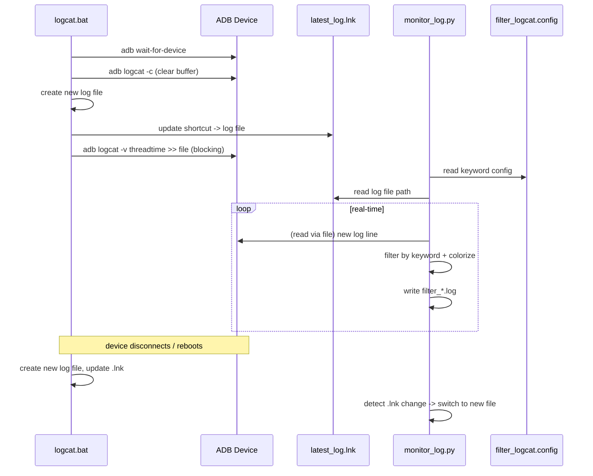

# Code Analysis — Logcat Toolset

> This document explains in detail how each file in the `logcat/` folder works.
> Purpose: help the reader understand the data flow, the role of each component, and the internal logic.

---

## 1. Architecture Overview

The toolset consists of **4 files** working together in a **Capture → Filter → Display** model:

```
┌─────────────────┐      .lnk (shortcut)      ┌──────────────────────┐
│   logcat.bat    │ ────────────────────────► │   monitor_log.py     │
│  (captures log  │   points to the current   │  (reads, filters,    │
│   from ADB,     │   log file                │   colors, writes     │
│   writes file)  │                           │   filter file)       │
└─────────────────┘                           └──────────────────────┘
        │                                              ▲
        │ reads config                                 │ reads config
        ▼                                              │
┌─────────────────┐                           ┌──────────────────────┐
│ filter_logcat.  │                           │  monitor_log.bat     │
│ config          │                           │  (wrapper runs .py)  │
└─────────────────┘                           └──────────────────────┘
```

**How it works:**

1. `logcat.bat` connects to ADB, clears the buffer, and captures logcat into `logs\log_<user>_<timestamp>.log`.
2. `logcat.bat` creates the `latest_log.lnk` shortcut pointing to the current log file.
3. `monitor_log.py` reads `latest_log.lnk` to know which file is currently being written.
4. `monitor_log.py` filters lines matching keywords (from `filter_logcat.config`), colors them, prints them to the screen, and writes them to `filter_<log name>`.
5. When the device reboots/disconnects, `logcat.bat` creates a new file and updates `.lnk`; `monitor_log.py` detects this and switches to the new file.

---

## 2. Per-File Analysis

### 2.1 `logcat.bat` — Capturing log from ADB

**Role:** The "data source". Runs an infinite loop to capture logcat and write it to a file.

**Main steps:**

| Step | Content | Explanation |
|------|---------|-------------|
| 0a | Check `%OS%` == `Windows_NT` | Windows only |
| 0b | `where adb` | Check ADB is in PATH |
| 0c | `mkdir logs` | Create the log output folder |
| 1 | `adb wait-for-device` | Wait for the device to connect |
| 1.5 | `timeout /t 2` | Wait for logd to start (especially after reboot) |
| 2 | `adb logcat -c` | Clear the old logcat buffer |
| 3 | PowerShell `Get-Date` | Generate a consistent `yyyyMMdd_HHmmss` timestamp |
| 3.5 | `type nul > "!LOG_FILE!"` | Create the log file first so `.lnk` always points to an existing file |
| 3.6 | PowerShell `WScript.Shell` | Create the `latest_log.lnk` shortcut pointing to the log file |
| 4 | `adb logcat -v threadtime >> "!LOG_FILE!"` | Append log to file — **blocking** |
| 5 | `goto CAPTURE_LOOP` | On disconnect, loop back to step 1 to create a new file |

**Notable points:**
- `setlocal enabledelayedexpansion` + `!VAR!` — uses delayed expansion because variables are assigned and read within the same `if`/loop block.
- `>>` (append) instead of `>` (overwrite) — because the file was already created in step 3.5, we don't want to wipe it.
- `goto CAPTURE_LOOP` loop — automatically creates a **new log file** each time the device reconnects.

---

### 2.2 `monitor_log.py` — Filtering & displaying log

**Role:** The "processor". Reads the original log file, filters by keyword, colors output, and writes the filter file.

#### Main functions

| Function | Purpose |
|----------|---------|
| `get_target_from_lnk()` | Uses `win32com` to read the `.lnk` shortcut and get the real log file path |
| `load_filters_from_config()` | Reads `filter_logcat.config` (JSON), keeps only groups/keywords with `Enable: true` |
| `colorize_line()` | Uses the `LOG_PATTERN` regex to detect the log level (V/D/I/W/E/F) and wraps it in ANSI colors |
| `compile_keyword_patterns()` | Converts keywords to patterns: with `*` → regex, without `*` → substring |
| `line_matches()` | Checks whether a log line matches any pattern |
| `monitor_log()` | Main function: scans existing log + real-time loop + auto-refresh to new file |
| `analyze_log_file()` | Re-analyzes an old log file (no real-time): filters, prints, and writes `filter_<name>` |

#### ANSI color table

```python
COLORS = {
    "V": gray,   # Verbose
    "D": cyan,   # Debug
    "I": green,  # Info
    "W": yellow, # Warning
    "E": red,    # Error
    "F": red bg, # Fatal
}
```

#### Regex for the `threadtime` format

```python
LOG_PATTERN = re.compile(
    r"^\d{2}-\d{2}\s\d{2}:\d{2}:\d{2}\.\d{3}\s+\d+\s+\d+\s+([VDIWEF])\s"
)
```

Breaking it down:
- `\d{2}-\d{2}` — month-day (`MM-DD`)
- `\s\d{2}:\d{2}:\d{2}\.\d{3}` — hour:minute:second.millisecond
- `\s+\d+\s+\d+` — PID and TID
- `([VDIWEF])` — **log level** (captured group used for coloring)

#### Keyword filtering mechanism (wildcard)

```python
def compile_keyword_patterns(keywords):
    for kw in keywords:
        if '*' in kw:
            regex = re.escape(kw).replace(r'\*', '.*')
            patterns.append(("regex", re.compile(regex, re.IGNORECASE)))
        else:
            patterns.append(("plain", kw.lower()))
```

- Keyword with `*` (e.g. `CAR.AUDIO.*`) → compiled to regex `CAR\.AUDIO\..*` (prefix match).
- Keyword without `*` → simple substring match (faster).

#### Real-time loop + auto-refresh

```python
while True:
    # Every 2s check whether .lnk points to a new file
    if time.time() - last_check >= 2:
        new_log_path = get_target_from_lnk(lnk_path)
        if new_log_path != log_path:
            # Close old file, open new file, clear screen, rescan
            ...

    line = f_in.readline()
    if not line:
        time.sleep(0.5)   # no new line yet
        continue
    if line_matches(line.lower(), patterns):
        print(colorize_line(line))
        f_out.write(line)
        f_out.flush()     # write immediately
```

**Idea:** When `logcat.bat` creates a new file (after reboot), `.lnk` is updated. `monitor_log.py` detects the path change every 2 seconds, closes the old file, opens the new one, and rescans from the beginning.

#### Re-analyzing an old log file

`analyze_log_file()` lets you re-analyze an old log file (no real-time monitoring). It is invoked when a file path is passed as a command-line argument:

```python
def analyze_log_file(log_path, groups):
    # Checks the file exists
    # Gathers enabled keywords and compiles patterns
    # Opens the log file (read) and filter_<name> (write, 'w' to overwrite)
    # Iterates lines, prints matching ones (colorized), writes them, counts them
    # Reports the total number of matching lines
```

Key points:
- Uses `with open(...)` so files are closed automatically (no handle leak).
- Writes the filter file with mode `'w'` (overwrite) instead of `'a'` (append).
- Reports the total count of matching lines when done.

#### Entry point (`__main__`)

```python
if __name__ == "__main__":
    LNK_FILE = "latest_log.lnk"
    CONFIG_FILE = "filter_logcat.config"

    FILTER_GROUPS = load_filters_from_config(CONFIG_FILE)

    # If a file path argument is passed -> re-analyze an old log file
    if len(sys.argv) > 1:
        analyze_log_file(sys.argv[1], FILTER_GROUPS)
    else:
        # No argument -> current logic: real-time monitoring via .lnk
        monitor_log(LNK_FILE, FILTER_GROUPS)
```

- **With a file path argument** (`python monitor_log.py logs\log_...log`) → `analyze_log_file()`.
- **Without an argument** (`python monitor_log.py`) → `monitor_log()` (real-time via `.lnk`).

#### Resource cleanup (no handle leak)

The `try/except` block ends with a `finally` clause that always closes both files, regardless of how the loop exits (normal, `Ctrl+C`, or error):

```python
    except KeyboardInterrupt:
        print("\n[INFO] Stopped monitoring log.")
    except Exception as e:
        print(f"\n[ERROR] An error occurred: {e}")
    finally:
        # Close files to avoid handle leaks on exit (Ctrl+C or error)
        try:
            f_out.close()
        except Exception:
            pass
        try:
            f_in.close()
        except Exception:
            pass
```

---

### 2.3 `filter_logcat.config` — Filter configuration

**Role:** JSON file declaring keyword groups used for filtering.

```json
[
  {
    "Description": "System crash",
    "Enable": true,
    "filters": [
      { "keyword": "crash", "Enable": true },
      ...
    ]
  }
]
```

**Structure:**
- Each element is a **group** (`Description`, `Enable`, `filters`).
- A group with `Enable: false` → skipped entirely.
- Within `filters`, each item can be:
  - A plain string: `"crash"` (enabled by default)
  - An object: `{ "keyword": "...", "Enable": true/false }`

**Note:** If the config is missing, malformed, or no group is enabled, the script falls back to `default_groups` (only "system crash") and prints a clear warning.

---

### 2.4 `monitor_log.bat` — Wrapper

**Role:** Runs `monitor_log.py` and keeps the CMD window open with `pause`.

```bat
:: --- PREREQUISITE CHECKS ---
:: 0a. Check Windows
:: 0b. Check 'python' is in PATH
:: 0c. Check 'pywin32' is installed (python -c "import win32com.client")

python monitor_log.py
pause
```

It now performs prerequisite checks (Windows, Python, `pywin32`) before running the script, giving clear error messages instead of cryptic failures.

---

## 3. Detailed Data Flow Diagram



---

## 4. Strengths & Limitations

### Strengths
- ✅ Separation of capture and filter — easy to maintain.
- ✅ Wildcard keyword support.
- ✅ Automatically follows the new file when the device reboots.
- ✅ Color-coded by log level, easy to read.
- ✅ Writes the filter file immediately (no log loss on crash).
- ✅ Files are closed on exit (no handle leak).
- ✅ Clear warnings when no filter group is enabled.

### Limitations
- ⚠️ Depends on Windows (`pywin32`, `.lnk`) — does not run on Linux/macOS.
- ⚠️ `logcat.bat` only captures the `main` buffer (no `-b all`).
- ⚠️ `LOG_PATTERN` depends on the `-v threadtime` format.
- ⚠️ Busy-wait loop (`readline()` + `sleep(0.5)`).
